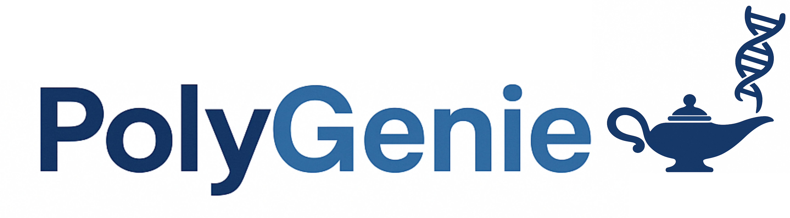

**PolyGenie** is a tool for polygenic risk score (PRS) analysis, PheWAS (phenome-wide association studies), and visualization of prevalence by percentile. It consists of a Nextflow pipeline for computing regressions using PRS, scripts to ingest the results into a SQLite database, and a Dash-based web application for exploration.

---

## Table of Contents

* [Features](#features)
* [Folder Structure](#folder-structure)
* [Installation](#installation)
* [Input Data](#input-data)
* [Pipeline Usage](#pipeline-usage)
* [Building the Database](#building-the-database)
* [Launching the App](#launching-the-app)
* [Demo / Toy Dataset](#demo--toy-dataset)
* [Containerization](#containerization)
* [License](#license)

---

## Features

* Run regression analyses across multiple phenotypes with PRS
* Compute prevalence by PRS percentile, overall and sex-specific
* Explore results via an interactive web dashboard:

  * PheWAS
  * Prevalence by percentile plots (all, male, female)
  * Table of top hits

---

## Folder Structure

| Folder     | Purpose                                                    |
| ---------- | ---------------------------------------------------------- |
| `app/`     | Dash app (`app.py`) and related UI scripts                 |
| `config/`  | Nextflow configuration files                               |
| `data/`    | External reference data, e.g., GWAS metadata               |
| `db/`      | SQLite database and `schema.sql`                           |
| `envs/`    | Conda environment YAML (`environment.yml`)                 |
| `modules/` | Nextflow modules                                           |
| `results/` | Nextflow outputs: PRS, regressions, percentiles            |
| `scripts/` | Helper scripts called by pipeline modules and to build the SQLite database from pipeline results |
| `main.nf`  | Main Nextflow workflow                                     |

---

## Installation

### Environment

PolyGenie requires Python 3.10+ and the following packages:

```bash
conda env create -f envs/environment.yml
conda activate polygenie
```

> **Note:** For clusters, you can build a container instead of installing dependencies multiple times. See [Containerization](#containerization).

---

## Input Data

The pipeline expects the following metadata and data files:

### Phenotype Metadata (`data/phenotype_metadata.csv`)

| Column        | Description                                          |
| ------------- | ---------------------------------------------------- |
| `Variable`    | Internal variable name                               |
| `Description` | Human-readable description                           |
| `Class`       | High-level category                                  |
| `ClassFile`   | Path to CSV containing values                        |
| `Domain`      | Subcategory / measurement type                       |
| `Type`        | `continuous` or `binary`                             |
| `Sex`         | `male`, `female`, or `both`                          |
| `Covariates`  | Covariates to use in regression (`sex`, `age`, etc.) |

**Example:**

```csv
Variable;Description;Class;ClassFile;Domain;Type;Sex;Covariates
CALC_AVG_PESO;Weight;Questionnaire;data/phenotypes/questionnaire.csv;Measurements;continuous;both;sex
```

### PRS Metadata (`data/prs_metadata.csv`)

| Column  | Description                                   |
| ------- | --------------------------------------------- |
| `name`  | Internal PRS name                             |
| `path`  | Path to PRS profile file                      |
| `label` | Human-readable label                          |
| `sex`   | Whether it is a sex-specific PRS or not (`male`, `female`, `both`) |

**Example:**

```csv
name,path,label,sex
frailty,data/prs/frailty.profiles,Fried Frailty,both
```

### GWAS Metadata (`data/gwas_metadata.csv`)

Contains information about the source GWAS:

| Column                                                            | Description           |
| ----------------------------------------------------------------- | --------------------- |
| `name`                                                            | Internal GWAS name    |
| `path`                                                            | Path to sumstats file |
| `label`                                                           | Human-readable label  |
| `n_cases`, `n_controls`, `n`                                      | Sample sizes          |
| `population`, `sex`, `sampling`                                   | Population metadata   |
| `prevalence`, `mean`, `sd`                                        | Trait summary stats   |
| `source`, `sumstats_source`, `prevalence_mean_source`, `comments` | References and notes  |

**Example:**

```csv
name,path,label,n_cases,n_controls,n,population,sex,sampling,prevalence,mean,sd,source,sumstats_source,prevalence_mean_source,comments
frailty,/path/to/frailty.tsv,Fried Frailty,,,386565,EUR,both,,,0.6415,0.8657,https://doi.org/...,https://figshare.com/...,https://doi.org/...,
```

### Covariates (`data/covars.csv`)

Contains individual-level covariates for regressions:

| Column | Description      |
| ------ | ---------------- |
| `id`   | Individual ID    |
| `sex`  | Male / Female    |
| `age`  | Age in years     |
| `bmi`  | BMI              |
| ...    | Other covariates |

### PRS score files

Each PRS must be provided as a **tab-delimited file** with at least two columns:

```text
ID	PRS
IND1	0.876
```

* `ID`: individual identifier (must match phenotype and covariate files)
* `PRS`: numeric polygenic risk score

Multiple PRS files are allowed.

---

### Phenotype files

Phenotypes are stored as **wide tables**, one file per phenotype class (e.g. ICD codes, questionnaires).

Example (`phenotypes/icd_codes.csv`):

```text
ID;A02;A03;A04;A05;...
IND1;0;0;1;0;...
```

* First column must be `ID`
* Remaining columns are phenotype variables
* Binary phenotypes should be encoded as `0/1`
* Continuous phenotypes are allowed

---

## Pipeline Usage

Run the main Nextflow workflow:

```bash
nextflow run main.nf \
  -profile standard \
  --paths.output_dir results \
  --paths.envs_dir envs \
  --prs.check_columns PRS1 PRS2 PRS3
```

* The workflow will compute regressions, generate percentiles, and produce summary CSVs.
* Outputs are written to `results/`.
* Cluster profiles can be used for HPC environments.

---

## Building the Database

After the pipeline finishes, build the SQLite database:

```bash
python scripts/db/db_loader.py
```

This script will:

1. Create the SQLite schema (`db/schema.sql`)
2. Insert phenotypes, PRS manifests, and GWAS metadata
3. Load regression results (`results/regressions/*.csv`)
4. Load prevalence / percentile data (`results/percentiles/*.csv`)

The resulting database (`db/polygenie.db`) will be used by the Dash app.

---

## Launching the App

Run the Dash application:

```bash
cd app
python app.py
```

* Open the app in a web browser: [http://127.0.0.1:8050](http://127.0.0.1:8050)
* Select PRS, reference group, and division (e.g., 10 for deciles)
* Click on a disease/target in the PheWAS plot to view prevalence by percentile

---

## Demo / Toy Dataset

For users who want to test PolyGenie without sensitive cohort data:

1. A toy dataset with 500 anonymized individuals is provided in `results/preprocessing/phenotypes_toy.csv`
2. Columns and structure match the full dataset
3. Correlations are intentionally broken to protect privacy

Use this dataset to explore the app and visualize plots without exposing real participant data.

---

## Containerization (Optional)

For reproducible runs on any system:

1. Build the container:

```bash
docker build -t polygenie:latest .
```

2. Run Nextflow using the container:

```bash
nextflow run main.nf -profile docker ...
```

---

## License and Citation

MIT License — see [LICENSE](LICENSE)

If you use this tool, please cite the relevant GWAS sources and acknowledge the PolyGENIE pipeline.
